# 福建省新场景售彩系统设计方案

## 第一章 项目概述

### 1.1 项目背景

根据《"十五五"体育彩票渠道发展实施纲要》（征求意见稿）："积极探索与多业态融合发展。在零售、休闲娱乐、文旅等多业态高频服务场所积极增设'体彩服务角'，提供彩票销售、购彩咨询等服务，依托多业态流量优势扩大体育彩票服务覆盖面，拓宽体育彩票消费场景。"此项促进渠道业态多元化发展的工作已列入国家体育总局体育彩票管理中心2026年重点工作内容。

福建省体育彩票管理中心拟于2026年实施新场景售彩项目，项目开展包括制定试点方案及试点准备、试点营业及项目总结等全生命周期，服务覆盖方案编制、软件开发、门店建设、人员培训、运营监控、复盘总结、标准输出，全流程可量化、可验收、可复制推广。

### 1.2 项目目标

| 目标维度 | 量化指标 | 说明 |
|---------|---------|------|
| 合规率 | 100% | 方案完全符合《彩票管理条例》及监管要求 |
| 可落地性 | 100% | 每个场景具备明确的选址标准、建设流程、人员配置和预算 |
| 可复制性 | ≥90% | 运营规范标准可在同类业态场景中推广 |
| 创新性 | ≥80% | 业态创新、技术方案创新、运营模式创新 |

### 1.3 项目范围

- **业态场景：** 不少于2类差异化业态场景（休闲娱乐、文旅景区），区别于现有体彩传统店、便利连锁店等常见业态
- **门店建设：** ≥10个标准化新场景布建
- **软件开发：** 定制开发体彩专属即开票营销管理平台（客户端+后台管理系统+收银台终端）
- **运营监控：** 常态化运营监控与季度专项报告
- **人员培训：** 营业前1轮+营业后≥2轮培训，6类培训课件
- **复盘总结：** 运营规范标准编制+项目总结报告

### 1.4 术语与缩略语

| 术语/缩略语 | 全称 | 说明 |
|------------|------|------|
| VPN | Virtual Private Network | 虚拟专用网络，用于门店与云端之间的加密通信 |
| mTLS | Mutual TLS | 双向TLS认证，客户端和服务端互相验证证书 |
| VI | Visual Identity | 视觉识别系统，体彩品牌形象标准 |
| SOP | Standard Operating Procedure | 标准作业程序 |
| SLA | Service Level Agreement | 服务等级协议 |
| NVR | Network Video Recorder | 网络视频录像机 |
| CA | Certificate Authority | 证书颁发机构 |
| CRL | Certificate Revocation List | 证书吊销列表 |
| WAF | Web Application Firewall | Web应用防火墙 |
| RBAC | Role-Based Access Control | 基于角色的访问控制 |
| IPSec | Internet Protocol Security | 互联网协议安全 |
| OIDC | OpenID Connect | 开放身份认证协议 |

---

## 第二章 总体架构设计

### 2.1 架构设计原则

| 原则 | 说明 |
|------|------|
| 内网闭环 | 所有客户端均部署在门店内网，不直接暴露到公网，交易指令在门店内网发起 |
| 授权准入 | 客户端必须通过设备证书+账号双重认证后才可连接服务端 |
| 代理安全通道 | 内网通过VPN/mTLS加密隧道代理到公有云，防止中间人攻击 |
| 集中管控 | 服务端统一部署在公有云，便于运维、升级和数据汇总 |
| 合规优先 | 坚决杜绝互联网远程售彩，所有交易在门店物理空间内闭环完成 |
| 高可用 | 关键服务冗余部署，单点故障不影响整体服务 |

### 2.2 系统总体架构图

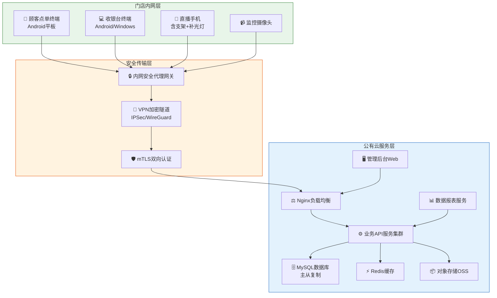

### 2.3 逻辑架构图

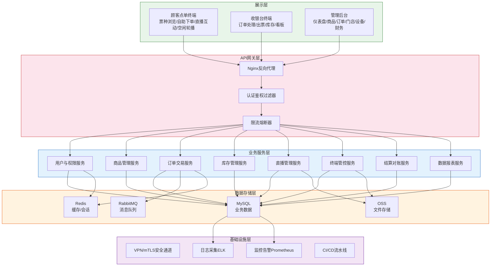

### 2.4 部署架构图

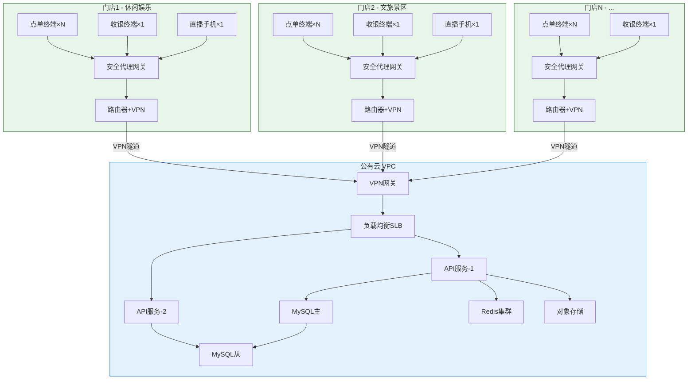

### 2.5 技术选型

| 层次 | 技术组件 | 选型 | 选型理由 |
|------|---------|------|---------|
| 后端框架 | Spring Boot 3.x | Java生态成熟，团队经验丰富 |
| 前端-点单终端 | Android原生 | 触屏交互体验好，设备管控能力强 |
| 前端-收银终端 | Android/Windows | 兼顾操作便捷性和打印外设兼容性 |
| 前端-管理后台 | Vue 3 + Element Plus | 组件丰富，开发效率高 |
| 数据库 | MySQL 8.0 | 事务支持完善，运维生态成熟 |
| 缓存 | Redis 7.x | 高性能缓存，支持会话管理和消息发布 |
| 消息队列 | RabbitMQ | 订单异步处理，削峰填谷 |
| 对象存储 | 阿里云OSS | 票面图片、直播截图等文件存储 |
| 负载均衡 | Nginx / SLB | 请求分发，SSL卸载 |
| VPN | WireGuard / IPSec | 轻量高效，配置简单 |
| 证书管理 | X.509 + 自建CA | 设备证书颁发和生命周期管理 |
| 监控 | Prometheus + Grafana | 指标采集与可视化 |
| 日志 | ELK Stack | 集中式日志采集和分析 |
| CI/CD | Jenkins + Docker | 自动化构建和部署 |

---

## 第三章 网络设计

### 3.1 网络总体设计

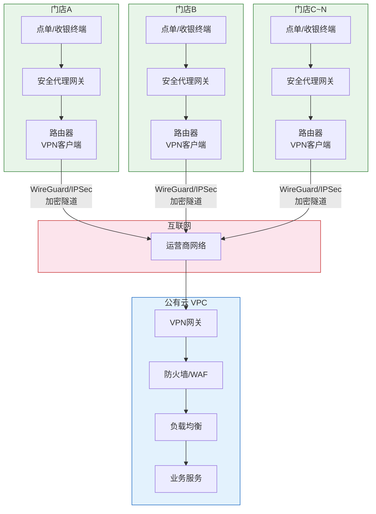

### 3.2 门店内网设计

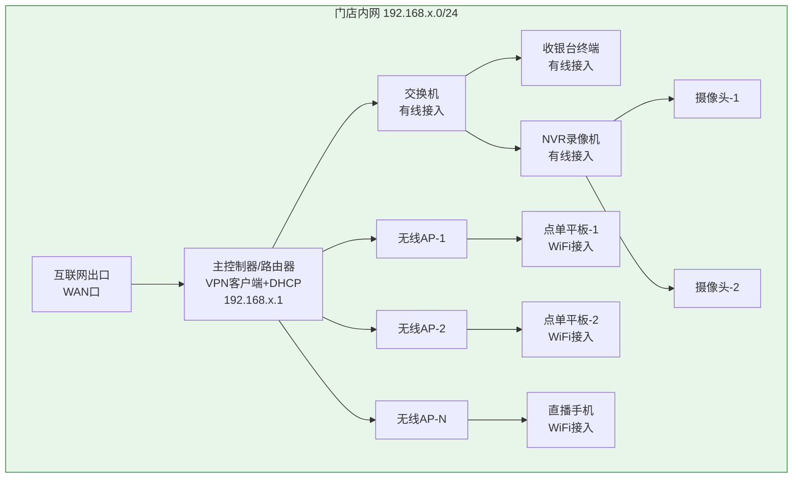

**门店内网VLAN规划：**

| VLAN ID | 名称 | 网段 | 用途 |
|---------|------|------|------|
| 10 | 设备管理 | 192.168.x.0/27 | 路由器、交换机、AP管理地址 |
| 20 | 业务终端 | 192.168.x.32/27 | 点单平板、收银终端、直播手机 |
| 30 | 监控网络 | 192.168.x.64/27 | NVR、摄像头 |
| 40 | VPN隧道 | 10.x.x.0/30 | VPN点对点隧道地址 |

### 3.3 安全通道设计

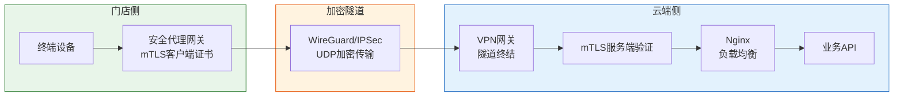

**安全通道建立流程：**

1. **VPN隧道建立：** 门店路由器启动后自动向云端VPN网关发起WireGuard/IPSec连接，通过预共享密钥完成身份验证，建立加密隧道
2. **mTLS认证：** 终端请求经安全代理网关转发时，网关携带客户端设备证书，云端Nginx验证客户端证书合法性
3. **请求放行：** 证书验证通过后，请求被转发至业务API服务；验证失败则直接拒绝连接

### 3.4 IP规划与域名设计

| 网络区域 | 网段 | 说明 |
|---------|------|------|
| 门店内网 | 192.168.{门店ID}.0/24 | 每个门店独立子网，门店ID从1开始 |
| VPN隧道 | 10.{门店ID}.0.0/30 | 点对点隧道，每个门店占用4个地址 |
| 云端VPC | 172.16.0.0/16 | 公有云虚拟私有云 |
| 云端业务子网 | 172.16.1.0/24 | API服务、管理后台 |
| 云端数据子网 | 172.16.2.0/24 | MySQL、Redis |
| 云端公共子网 | 172.16.3.0/24 | VPN网关、SLB、NAT |

**域名设计：**

| 域名 | 解析 | 用途 |
|------|------|------|
| api.lottery.internal | VPN内网地址 | 业务API服务 |
| admin.lottery.internal | VPN内网地址 | 管理后台 |
| mqtt.lottery.internal | VPN内网地址 | 消息推送服务 |

### 3.5 网络安全策略

| 安全层级 | 策略 | 说明 |
|---------|------|------|
| 边界安全 | IP白名单 | 云端仅接受已注册门店VPN出口IP的连接 |
| 边界安全 | 防火墙规则 | 仅开放业务所需端口（443/HTTPS、VPN端口） |
| 接入安全 | 设备准入 | 仅授权设备（MAC+序列号白名单）可接入门店内网 |
| 接入安全 | 证书管理 | 设备证书有效期1年，到期前30天自动续期 |
| 传输安全 | 全程加密 | VPN隧道+mTLS双重加密，无明文传输 |
| 传输安全 | 证书吊销 | 设备丢失或违规时，通过CRL即时吊销证书 |
| 审计安全 | 流量日志 | 所有出入流量记录日志，保留≥180天 |
| 审计安全 | 异常检测 | 异常流量、异常访问时间、异常设备自动告警 |

---

## 第四章 功能模块设计

### 4.1 功能模块总览

```mermaid
graph TD
    ROOT["体彩专属即开票<br/>营销管理平台"]

    ROOT --> C["顾客点单终端"]
    ROOT --> S["收银台终端"]
    ROOT --> B["后台管理系统"]
    ROOT --> API["服务端API"]

    C --> C1["票种浏览"]
    C --> C2["自助下单"]
    C --> C3["直播互动"]
    C --> C4["空闲轮播"]

    C1 --> C1a["大图卡片展示"]
    C1 --> C1b["分类筛选"]
    C1 --> C1c["直播推荐标识"]

    C2 --> C2a["购物车"]
    C2 --> C2b["扫码支付"]

    C3 --> C3a["直播信息展示"]
    C3 --> C3b["快捷加购"]
    C3 --> C3c["优惠活动"]

    C4 --> C4a["热门票种轮播"]
    C4 --> C4b["中奖故事"]
    C4 --> C4c["触摸唤醒"]

    S --> S1["登录与设备认证"]
    S --> S2["订单处理与出票"]
    S --> S3["库存操作"]
    S --> S4["销售看板"]

    S1 --> S1a["设备绑定"]
    S1 --> S1b["证书校验"]
    S1 --> S1c["账号登录"]

    S2 --> S2a["接收订单"]
    S2 --> S2b["确认出票"]
    S2 --> S2c["代客下单"]
    S2 --> S2d["打印小票"]

    S3 --> S3a["入库签收"]
    S3 --> S3b["库存盘点"]
    S3 --> S3c["库存查询"]
    S3 --> S3d["预警提示"]

    S4 --> S4a["今日销售"]
    S4 --> S4b["趋势图"]
    S4 --> S4c["待处理队列"]

    B --> B1["数据仪表盘"]
    B --> B2["商品管理"]
    B --> B3["订单监控"]
    B --> B4["门店管理"]
    B --> B5["账号权限"]
    B --> B6["设备授权"]
    B --> B7["财务结算"]
    B --> B8["经营分析"]

    API --> A1["用户与权限"]
    API --> A2["商品管理"]
    API --> A3["订单交易"]
    API --> A4["库存管理"]
    API --> A5["直播管理"]
    API --> A6["终端管控"]
    API --> A7["结算对账"]
    API --> A8["数据报表"]

    style ROOT fill:#1565c0,color:#fff
    style C fill:#e8f5e9,stroke:#2e7d32
    style S fill:#fff3e0,stroke:#e65100
    style B fill:#e3f2fd,stroke:#1565c0
    style API fill:#f3e5f5,stroke:#6a1b9a
```

### 4.2 顾客点单终端功能设计

**票种浏览：** 以大图卡片形式展示当前门店可售的顶呱刮票种（票面图片、面值、玩法说明、中奖概率），支持按面值、主题、热销排行分类筛选，展示当前直播推荐票种的醒目标识。

**自助下单：** 顾客自行选择票种和数量加入购物车，确认订单后选择扫码支付（微信/支付宝），支付成功后等待出票。

**直播互动：** 展示当前正在进行的直播信息和主播推荐票种，直播期间可快捷将推荐票种加入购物车，显示直播优惠活动信息。

**空闲轮播：** 无人操作时自动进入轮播模式，展示热门票种、中奖故事、促销活动，触摸屏幕立即唤醒进入点单界面。

### 4.3 收银台终端功能设计

**登录与设备认证：** 首次使用时绑定设备（录入设备指纹，下发设备证书），每次启动自动校验设备证书有效性，操作员输入账号密码登录。

**订单处理与出票：** 实时接收顾客点单终端推送的待支付订单（声音+弹窗提醒），逐笔确认订单，收银后点击"已出票"打印小票（含订单和即开票序列号信息），支持代客下单。

**库存操作：** 入库签收（扫描批次条码完成入库）、库存盘点（录入实际盘点数量）、库存查询（查看本店各票种剩余数量）、库存预警提示。

**销售看板：** 今日销售额、订单数、热销票种，本周/本月销售趋势图，待处理订单队列。

### 4.4 后台管理系统功能设计

| 功能模块 | 功能描述 |
|---------|---------|
| 数据仪表盘 | 全局销售概览、实时数据大屏、关键指标趋势 |
| 商品上架管理 | 维护票种信息、控制上下架、票面图片管理 |
| 订单监控 | 实时查看全部门店订单动态、异常订单预警 |
| 门店管理 | 门店基础信息、营业状态、区域划分 |
| 账号权限管理 | 用户管理、角色分配、操作日志查询 |
| 设备授权管理 | 设备注册/吊销、在线状态监控、远程升级 |
| 财务结算 | 佣金计算、对账、报表导出 |
| 经营分析报表 | 多维度销售分析、门店对比、票种结构分析 |

### 4.5 服务端功能设计

| 服务模块 | 核心功能 | 关键设计 |
|---------|---------|---------|
| 用户与权限 | 账号管理、角色权限、登录认证、设备绑定、操作日志 | RBAC权限模型，操作日志全量记录 |
| 商品管理 | 票种维护、上下架、即开票序列号管理 | 批次号+序列号追溯体系 |
| 订单交易 | 创建订单、支付收款、出票确认、状态流转、退款 | 状态机模式，待支付→已支付→已出票→已完成 |
| 库存管理 | 入库登记、查询、出库记录、盘点 | 乐观锁并发控制，差异预警 |
| 直播管理 | 直播计划、关联、记录、数据复盘 | 关联腾讯会议/瞩目，本系统做业务关联 |
| 终端管控 | 设备注册、授权/吊销、在线监控、远程配置、版本管理 | X.509证书体系，CRL即时吊销 |
| 结算对账 | 佣金计算、对账、报表导出 | T+1自动对账，差异自动标记 |
| 数据报表 | 销售日报/周报/月报 | 定时任务自动生成 |

---

## 第五章 核心业务流程设计

### 5.1 自助购彩流程

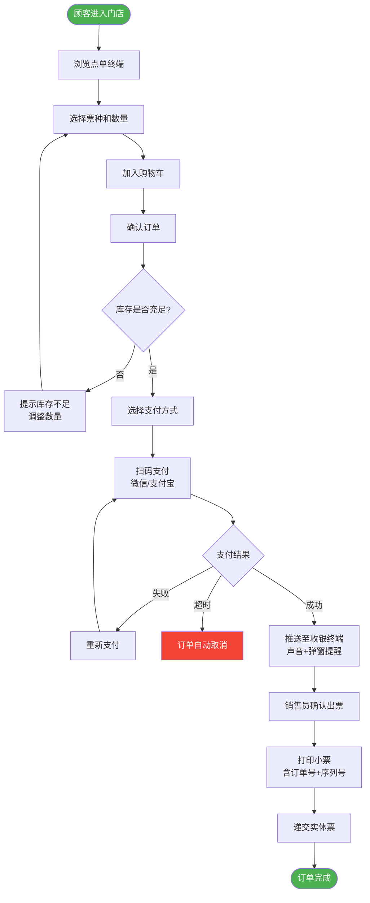

### 5.2 代客下单流程

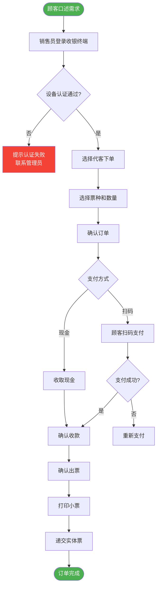

### 5.3 库存管理流程

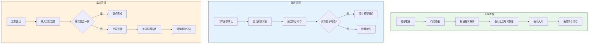

### 5.4 直播互动流程

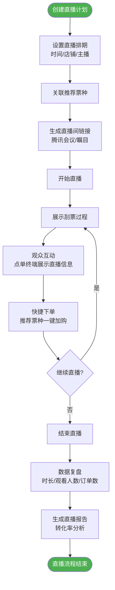

### 5.5 设备授权流程

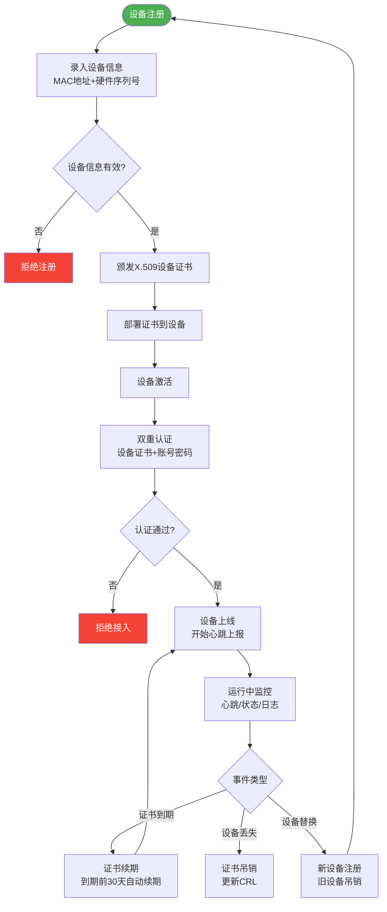

### 5.6 运营监控流程

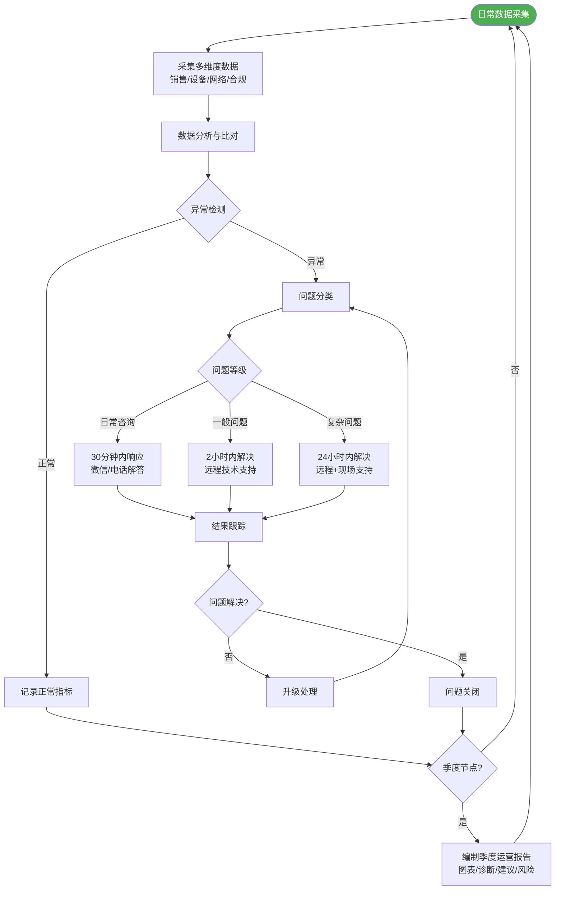

---

## 第六章 核心时序设计

### 6.1 自助下单时序图

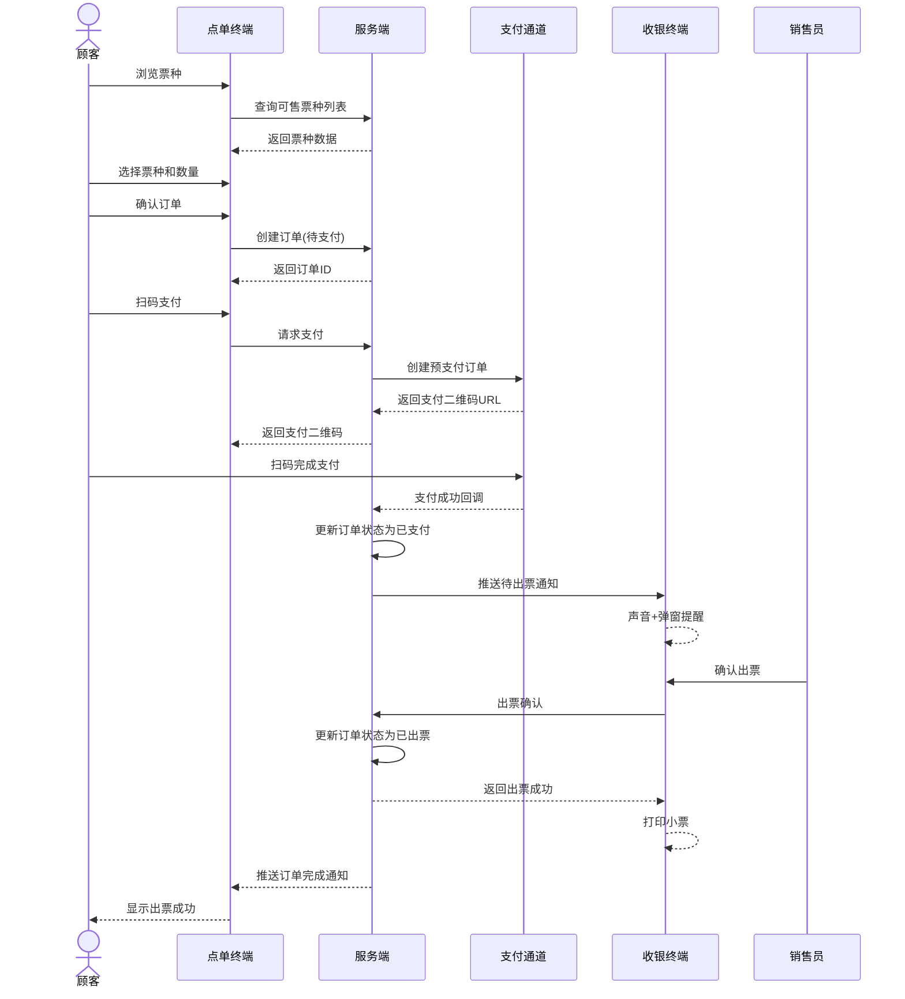

### 6.2 支付结算时序图

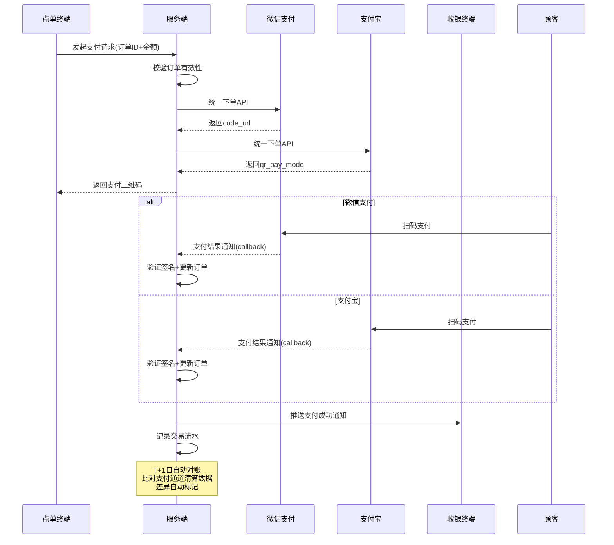

### 6.3 设备认证时序图

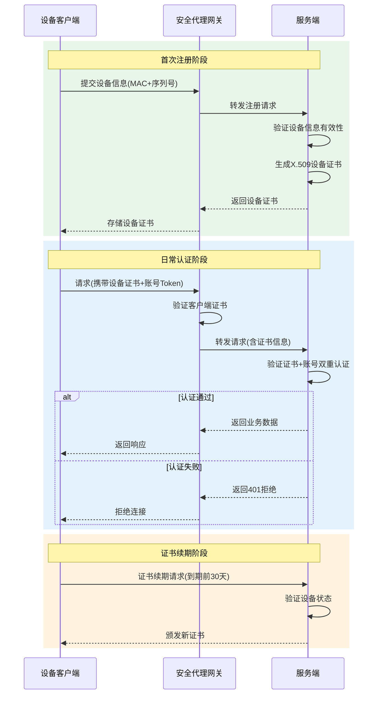

### 6.4 VPN隧道建立时序图

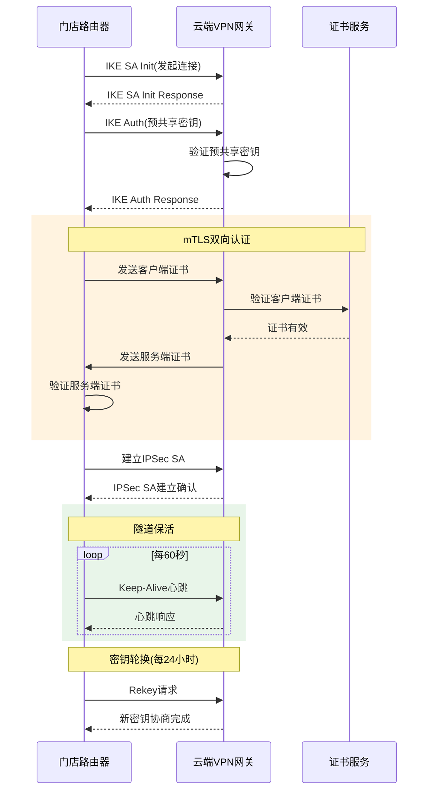

### 6.5 库存同步时序图

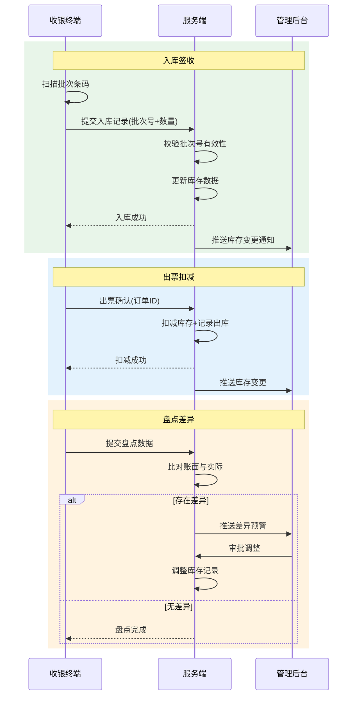

### 6.6 直播互动时序图

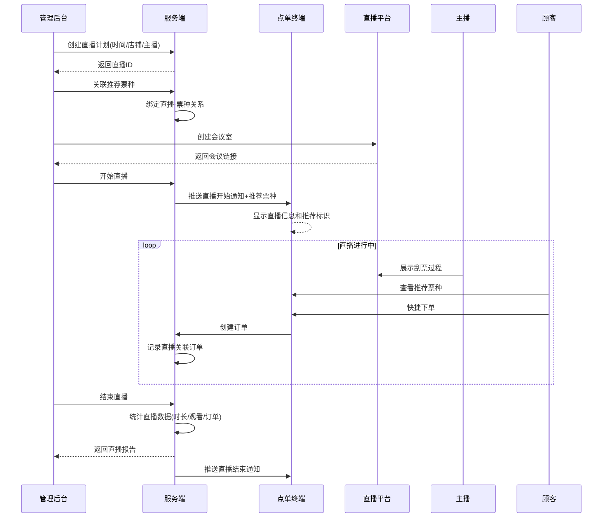

---

## 第七章 数据设计

### 7.1 数据模型设计

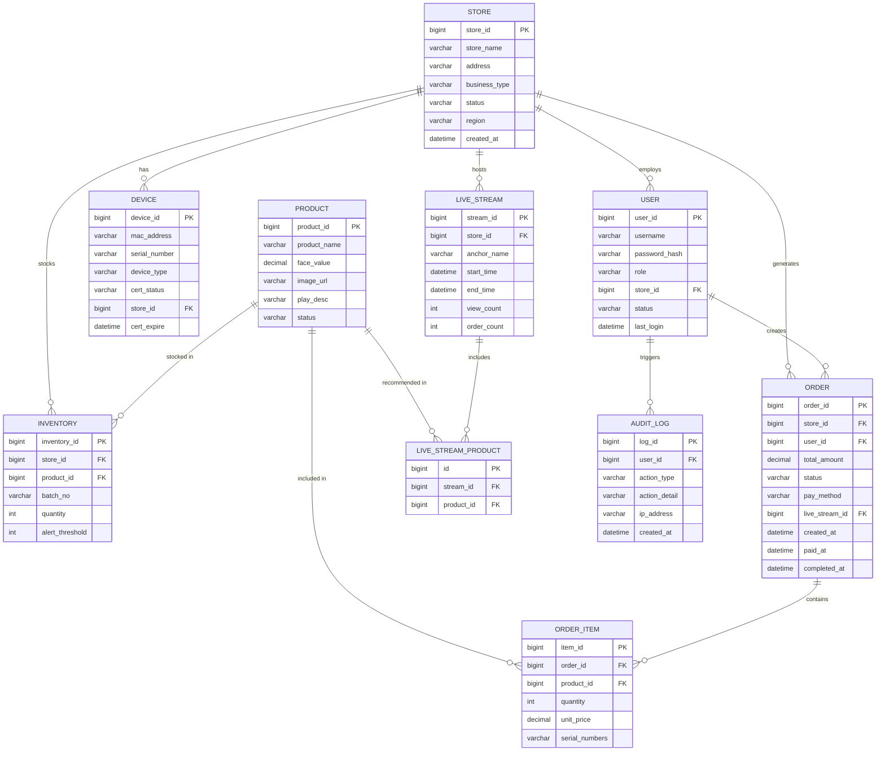

### 7.2 数据安全设计

**加密存储分级：**

| 数据级别 | 数据类型 | 加密方式 | 说明 |
|---------|---------|---------|------|
| 极敏感 | 支付密钥、证书私钥 | AES-256 + KMS托管 | 应用层加密，密钥不落地 |
| 敏感 | 用户密码 | bcrypt哈希 | 单向哈希，不可逆 |
| 敏感 | 设备证书 | 加密文件存储 | 证书私钥加密保护 |
| 一般 | 订单数据、库存数据 | 传输加密(TLS) | 数据库透明加密 |
| 公开 | 票种信息、门店信息 | 传输加密(TLS) | 无需额外加密 |

**数据访问控制：** 基于RBAC模型，不同角色访问不同数据范围。店长可查看本店全部数据，销售员仅可操作订单和库存，管理员可查看全局数据。

**数据备份策略：**

| 备份类型 | 频率 | 保留时间 | 存储位置 |
|---------|------|---------|---------|
| 全量备份 | 每日 | 30天 | 异地OSS |
| 增量备份 | 每小时 | 7天 | 本地+异地 |
| 事务日志 | 实时 | 7天 | 本地 |
| 配置备份 | 变更时 | 永久 | Git仓库 |

### 7.3 数据接口设计

**与体彩中心现有系统的对接接口：**

| 接口类别 | 接口名称 | 方向 | 频率 | 说明 |
|---------|---------|------|------|------|
| 库存同步 | 即开票批次入库通知 | 本系统→体彩中心 | 实时 | 入库后同步批次信息 |
| 库存同步 | 库存余额查询 | 体彩中心→本系统 | 每日 | 核对库存一致性 |
| 库存同步 | 库存差异调整通知 | 体彩中心→本系统 | 按需 | 盘点差异审批后调整 |
| 销售上报 | 日销售数据上报 | 本系统→体彩中心 | 每日 | T+1日上报前日销售明细 |
| 销售上报 | 即开票序列号核销上报 | 本系统→体彩中心 | 实时 | 出票后上报已销售序列号 |
| 销售上报 | 退票/作废数据上报 | 本系统→体彩中心 | 实时 | 退票操作实时上报 |
| 资金对账 | 日终对账文件 | 本系统→体彩中心 | 每日 | T+1日生成对账文件 |
| 资金对账 | 差异对账处理 | 双向 | 按需 | 差异核实与调整 |
| 资金对账 | 佣金结算确认 | 体彩中心→本系统 | 每月 | 月度佣金结算确认 |

---

## 第八章 安全设计

### 8.1 安全架构总览

```mermaid
graph TD
    subgraph 物理安全层["物理安全层"]
        P1["门店门禁管理"]
        P2["设备防盗固定"]
        P3["监控摄像头覆盖"]
    end

    subgraph 网络安全层["网络安全层"]
        N1["VPN加密隧道"]
        N2["IP白名单"]
        N3["防火墙规则"]
        N4["VPC网络隔离"]
    end

    subgraph 传输安全层["传输安全层"]
        T1["mTLS双向认证"]
        T2["TLS 1.3加密"]
        T3["证书生命周期管理"]
    end

    subgraph 应用安全层["应用安全层"]
        A1["设备证书+账号双重认证"]
        A2["RBAC权限控制"]
        A3["WAF防护"]
        A4["输入校验/SQL注入防护"]
        A5["接口签名验证"]
    end

    subgraph 数据安全层["数据安全层"]
        D1["敏感数据加密存储"]
        D2["操作审计日志"]
        D3["数据备份与恢复"]
        D4["数据访问控制"]
    end

    P1 --> N1
    P2 --> N1
    P3 --> N1
    N1 --> T1
    N2 --> T1
    N3 --> T1
    N4 --> T1
    T1 --> A1
    T2 --> A2
    T3 --> A3
    A1 --> D1
    A2 --> D2
    A3 --> D3
    A4 --> D4
    A5 --> D2

    style 物理安全层 fill:#e8f5e9,stroke:#2e7d32
    style 网络安全层 fill:#e3f2fd,stroke:#1565c0
    style 传输安全层 fill:#fff3e0,stroke:#e65100
    style 应用安全层 fill:#fce4ec,stroke:#c62828
    style 数据安全层 fill:#f3e5f5,stroke:#6a1b9a
```

### 8.2 传输安全

**VPN隧道加密方案：**

| 项目 | 方案 |
|------|------|
| 隧道协议 | WireGuard（优先）或IPSec |
| 加密算法 | ChaCha20-Poly1305（WireGuard）/ AES-256-GCM（IPSec） |
| 密钥交换 | Curve25519（WireGuard）/ DH Group 14（IPSec） |
| 密钥轮换 | 每24小时自动Rekey |
| 隧道监控 | 心跳检测60秒间隔，3次丢失触发重连 |

**mTLS双向认证方案：**

| 项目 | 方案 |
|------|------|
| 证书格式 | X.509 v3 |
| 密钥算法 | RSA 2048 / ECDSA P-256 |
| 证书有效期 | 1年，到期前30天自动续期 |
| CA管理 | 自建私有CA，离线根CA+在线中间CA |
| CRL更新 | 证书吊销后1小时内更新CRL |
| 证书存储 | 设备端加密存储，私钥不可导出 |

### 8.3 接入安全

**设备证书+账号双重认证流程：**

1. 设备启动时，安全代理网关验证设备证书有效性（签名验证+CRL检查）
2. 证书验证通过后，用户输入账号密码进行身份认证
3. 双重认证均通过后，建立业务会话，分配访问Token
4. 后续请求携带Token，服务端验证Token有效性
5. Token有效期2小时，过期后需重新认证

**设备指纹绑定：** 每台授权设备绑定唯一设备指纹（MAC地址+硬件序列号哈希），设备信息变更时自动触发重新认证。

**授权准入机制：** 仅已注册且状态为"已授权"的设备可连接服务端，新设备需经管理员审批后方可注册。

### 8.4 应用安全

| 安全威胁 | 防护措施 |
|---------|---------|
| SQL注入 | 参数化查询+ORM框架+输入白名单校验 |
| XSS攻击 | 输出编码+Content-Security-Policy头+HttpOnly Cookie |
| CSRF攻击 | CSRF Token+SameSite Cookie+Referer校验 |
| 接口篡改 | 请求签名（HMAC-SHA256）+时间戳防重放 |
| 暴力破解 | 登录失败5次锁定15分钟+验证码 |
| 越权访问 | RBAC权限校验+数据范围过滤 |
| 敏感信息泄露 | 日志脱敏+错误信息通用化+调试模式关闭 |

### 8.5 合规边界界定

**核心原则：** 所有交易指令必须在门店物理空间内由现场人员发起，禁止远程下单，禁止非授权终端接入。

**合规边界定义：**

| 行为 | 是否合规 | 说明 |
|------|---------|------|
| 顾客在门店内通过点单终端自助下单 | ✅ 合规 | 交易在门店内网发起 |
| 销售员在门店收银台代客下单 | ✅ 合规 | 交易在门店内网发起 |
| 顾客通过手机APP远程下单 | ❌ 违规 | 属于互联网远程售彩 |
| 非授权终端通过互联网访问交易接口 | ❌ 违规 | 云端不直接开放交易接口 |
| 门店终端通过VPN隧道连接云端处理交易 | ✅ 合规 | 交易发起端在门店内网，云端仅处理经内网代理转发的请求 |
| 顾客在门店外扫码访问点单页面 | ❌ 违规 | 点单终端仅在内网可访问 |

**技术保障措施：**

- 云端API不直接暴露公网，仅接受VPN隧道内的请求
- 所有API请求必须携带有效的设备证书和用户Token
- 请求IP必须属于已注册门店的VPN出口IP白名单
- 点单终端和收银终端仅在内网环境运行，无公网访问能力

---

## 第九章 硬件与部署设计

### 9.1 门店硬件配置方案

**网络设备：**

| 设备 | 型号要求 | 数量 | 单价 | 小计 | 说明 |
|------|---------|------|------|------|------|
| 主控制器/路由器 | 支持WireGuard/IPSec VPN | 1台 | ¥800 | ¥800 | 含VPN客户端功能 |
| 交换机 | 3层千兆 | 3台 | ¥2,000 | ¥6,000 | 每层1台 |
| 无线AP | 802.11ac双频 | 30个 | ¥300 | ¥9,000 | 每层10个 |
| **网络小计** | | | | **¥15,800** | |

**终端设备：**

| 设备 | 规格 | 数量 | 年租用费 | 说明 |
|------|------|------|---------|------|
| 顾客点单平板 | 10寸Android触屏 | 按点位配置 | ¥500/台/年 | 含支架 |
| 收银台一体机 | 15寸Android/Windows | 每店1台 | ¥500/台/年 | 含小票打印机 |

**直播设备：**

| 设备 | 规格 | 数量 | 单价 | 说明 |
|------|------|------|------|------|
| 直播手机 | 主流品牌中高端 | 每店1部 | ¥3,000 | 含支架+补光灯 |

**监控设备：**

| 设备 | 规格 | 数量 | 说明 |
|------|------|------|------|
| 网络摄像头 | 1080P红外 | 每店2-4路 | 覆盖收银区和体彩服务角 |
| NVR | 4/8路 | 每店1台 | ≥2TB硬盘，存储≥30天 |

### 9.2 公有云资源配置方案

| 资源类型 | 规格 | 数量 | 用途 |
|---------|------|------|------|
| 应用服务器 | 4核8G | 2台 | 业务API服务，主备部署 |
| 数据库服务器 | 8核16G | 2台 | MySQL主从，高可用 |
| Redis缓存 | 4核8G | 2台 | Sentinel哨兵模式 |
| 对象存储 | 标准型 | 按量 | 票面图片、直播截图 |
| 负载均衡 | SLB | 1个 | HTTPS卸载+请求分发 |
| VPN网关 | IPsec VPN | 1个 | 门店隧道接入 |
| NAT网关 | 标准 | 1个 | 云端出公网（更新等） |
| 云监控 | 基础版 | 1套 | 服务器+数据库监控 |

### 9.3 单店典型部署图

```mermaid
graph TD
    subgraph 互联网接入["互联网接入"]
        ISP["运营商宽带<br/>≥100Mbps"]
    end

    subgraph 门店网络["门店网络"]
        RT["主控制器/路由器<br/>VPN客户端+DHCP<br/>防火墙"]
        SW["交换机<br/>千兆3层"]
        AP1["无线AP-1<br/>点单区"]
        AP2["无线AP-2<br/>收银区"]
        AP3["无线AP-3<br/>直播区"]

        PAD1["点单平板-1"]
        PAD2["点单平板-2"]
        PADN["点单平板-N"]
        CASH["收银台终端<br/>+小票打印机"]
        PHONE["直播手机<br/>+支架+补光灯"]
        NVR["NVR录像机<br/>≥2TB"]
        CAM1["摄像头-1<br/>收银区"]
        CAM2["摄像头-2<br/>体彩服务角"]
    end

    subgraph 云端["公有云"]
        VPN["VPN网关"]
        SVC["业务服务"]
    end

    ISP --> RT
    RT --> SW
    RT --> AP1
    RT --> AP2
    RT --> AP3
    SW --> CASH
    SW --> NVR
    AP1 --> PAD1
    AP1 --> PAD2
    AP2 --> PADN
    AP3 --> PHONE
    NVR --> CAM1
    NVR --> CAM2

    RT -->|"WireGuard/IPSec<br/>加密隧道"| VPN
    VPN --> SVC

    style 互联网接入 fill:#fce4ec,stroke:#c62828
    style 门店网络 fill:#e8f5e9,stroke:#2e7d32
    style 云端 fill:#e3f2fd,stroke:#1565c0
```

---

## 第十章 运维与监控设计

### 10.1 运维架构图

```mermaid
graph TD
    subgraph 数据源["数据采集层"]
        S1["门店设备<br/>终端状态/心跳"]
        S2["网络设备<br/>VPN状态/流量"]
        S3["业务系统<br/>订单/销售/库存"]
        S4["安全系统<br/>认证/审计日志"]
    end

    subgraph 监控中心["监控中心"]
        M1["Prometheus<br/>指标采集"]
        M2["Grafana<br/>可视化看板"]
        M3["ELK<br/>日志分析"]
        M4["告警引擎<br/>规则匹配"]
    end

    subgraph 响应层["响应处理层"]
        R1["微信/短信告警"]
        R2["运维工单系统"]
        R3["远程运维工具"]
        R4["现场运维团队"]
    end

    subgraph 报告层["报告输出层"]
        O1["日报/周报"]
        O2["季度运营报告"]
        O3["安全审计报告"]
    end

    S1 --> M1
    S2 --> M1
    S3 --> M1
    S4 --> M3
    M1 --> M2
    M1 --> M4
    M3 --> M4
    M4 --> R1
    R1 --> R2
    R2 --> R3
    R2 --> R4
    M2 --> O1
    M1 --> O2
    M3 --> O3

    style 数据源 fill:#e8f5e9,stroke:#2e7d32
    style 监控中心 fill:#e3f2fd,stroke:#1565c0
    style 响应层 fill:#fff3e0,stroke:#e65100
    style 报告层 fill:#f3e5f5,stroke:#6a1b9a
```

### 10.2 监控指标体系

**设备监控：**

| 指标 | 采集频率 | 告警阈值 | 说明 |
|------|---------|---------|------|
| 设备在线状态 | 60秒 | 离线>5分钟 | 心跳检测 |
| CPU使用率 | 60秒 | >85%持续10分钟 | 性能预警 |
| 内存使用率 | 60秒 | >90%持续10分钟 | 性能预警 |
| 磁盘使用率 | 5分钟 | >85% | 容量预警 |
| 终端应用版本 | 1小时 | 版本不一致 | 版本管理 |

**网络监控：**

| 指标 | 采集频率 | 告警阈值 | 说明 |
|------|---------|---------|------|
| VPN隧道状态 | 60秒 | 隧道断开 | 连通性监控 |
| 网络延迟 | 60秒 | >200ms | 体验预警 |
| 丢包率 | 60秒 | >1% | 质量预警 |
| 带宽利用率 | 5分钟 | >80% | 容量预警 |

**业务监控：**

| 指标 | 采集频率 | 告警阈值 | 说明 |
|------|---------|---------|------|
| 订单成功率 | 实时 | <99% | 交易异常 |
| 支付成功率 | 实时 | <98% | 支付异常 |
| 平均出票时间 | 实时 | >30秒 | 体验预警 |
| 日销售额 | 每日 | 同比下降>30% | 经营预警 |
| 库存预警 | 实时 | 低于阈值 | 补货提醒 |

**安全监控：**

| 指标 | 采集频率 | 告警阈值 | 说明 |
|------|---------|---------|------|
| 认证失败次数 | 实时 | 5次/分钟 | 暴力破解 |
| 异常IP访问 | 实时 | 非白名单IP | 非法访问 |
| 证书即将过期 | 每日 | 剩余<30天 | 续期提醒 |
| 数据库慢查询 | 实时 | >5秒 | 性能问题 |

### 10.3 告警与应急响应

**告警分级：**

| 级别 | 定义 | 通知方式 | 响应时效 |
|------|------|---------|---------|
| P0-紧急 | 系统不可用、数据丢失风险 | 电话+短信+微信 | 15分钟内响应 |
| P1-严重 | 单门店不可营业、支付故障 | 短信+微信 | 30分钟内响应 |
| P2-一般 | 性能下降、非关键功能异常 | 微信 | 2小时内处理 |
| P3-提示 | 容量预警、证书即将过期 | 微信 | 24小时内处理 |

**应急预案：**

| 场景 | 应急措施 | 恢复目标 |
|------|---------|---------|
| VPN隧道中断 | 自动重连+4G备用链路切换 | 5分钟内恢复 |
| 云服务宕机 | 备用节点自动切换 | 15分钟内恢复 |
| 数据库故障 | 主从切换+只读模式 | 30分钟内恢复 |
| 单终端故障 | 备用终端替换 | 4小时内到店 |
| 支付通道故障 | 切换备用支付通道/现金模式 | 10分钟内切换 |
| 数据安全事件 | 隔离受影响系统+数据备份恢复 | 2小时内控制 |

### 10.4 离线降级方案

**网络中断场景：**

| 降级措施 | 说明 |
|---------|------|
| 收银终端本地缓存 | 网络中断时，收银终端支持本地记录交易，网络恢复后自动同步 |
| 现金支付兜底 | 扫码支付不可用时，切换为现金支付模式 |
| 4G/5G备用链路 | 主链路中断时自动切换4G备用，保障VPN隧道连通 |
| 本地库存查询 | 网络中断时使用最近一次同步的库存数据 |

**云服务故障场景：**

| 降级措施 | 说明 |
|---------|------|
| 只读模式 | 数据库主库故障时切换从库，支持查询但不支持交易 |
| 本地缓存服务 | Redis不可用时降级为本地缓存 |
| 静态资源CDN | OSS不可用时从CDN获取静态资源 |

**单设备故障场景：**

| 降级措施 | 说明 |
|---------|------|
| 备用终端替换 | 仓库常备2台备用终端，4小时内到店替换 |
| 收银终端代行 | 点单平板故障时，顾客可在收银台终端完成下单 |
| 远程诊断 | 设备异常时先远程诊断，排除软件问题后再安排上门 |
